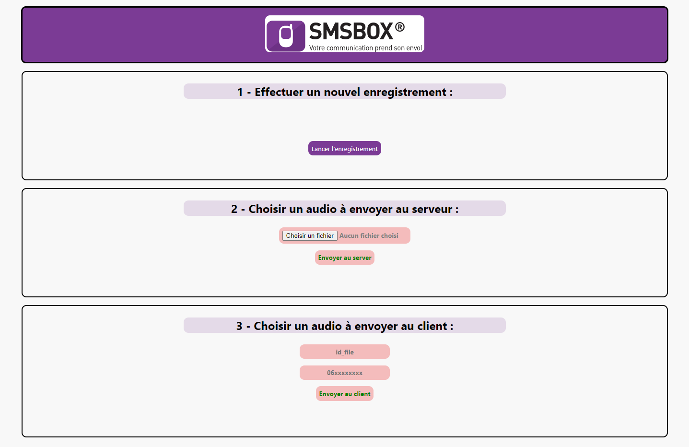

# [Test pour SMSBOX]

## À propos

SMSBOX met à disposition de ses clients un service de dépôts de messages vocaux sur répondeur.

Ce service est utilisé principalement pour la confirmation de rendez-vous, d'invitations, etc ...

L'objectif ici est de créer une interface web permettant d'effectuer les actions suivantes :
    - Enregistrer un fichier sonore en local.
    - Importer via l'API un fichier sonore enregistré en local (ressource import).
    - Déposer un fichier sonore sur un répondeur via l'API (ressource send).
 
## Table des matières

- 🪧 [À propos](#à-propos)
- 📦 [Aperçu](#Aperçu)
- 📦 [Prérequis](#prérequis)
- 🚀 [Installation](#installation)
- 🛠️ [Utilisation](#utilisation)
- 🏗️ [Construit avec](#construit-avec)
- 📚 [Documentation](#documentation)
- 🎉 [Gestion des versions](#gestion-des-versions)

## Aperçu

Aperçu de l'application



## Prérequis

Besoin d'un éditeur de code (VS code, Notepad++, NetBeans, etc...), de Git, ansi qu'un serveur local (WampServer par exemple).

## Installation

1. Récupérer votre API sur [https://client.smsbox.net/fr/apikeys](https://client.smsbox.net/fr/apikeys)
2. Clonez le repo :
   ```sh
   git clone https://github.com/name_project/Project-Name.git
   ```
3. Entrer votre API dans `./config/config.json` :
   ```js
   const API_KEY = 'ENTER YOUR API';
   ```

<p align="right">(<a href="#readme-top">back to top</a>)</p>

## Utilisation

1ere option : l'utilisateur a le choix d'enregistrer un nouvel audio sur son local.

2e option : l'utilisateur choisie un fichier audio déjà existant sur son local pour l'envoyer au serveur SMSBOX.

3e option : l'utilisateur rentre l'id_file d'un fichier déjà existant sur le serveur SMSBOX, ainsi que le numéro de téléphopne du destinataire, afin d'envoyer son message vocal à la personne souhaitée.

<p align="right">(<a href="#readme-top">back to top</a>)</p>

## Construit avec

### Langages & Frameworks

Langage utilisés : HTML, CSS, PHP, JS

### Outils

Vs Code
WampServer

<p align="right">(<a href="#readme-top">back to top</a>)</p>

## Documentation

Documentation API : https://fr.smsbox.net/docs/doc-VMM-SMSBOX-FR.pdf

Espace développeur pour les requêtes : https://www.smsbox.net/fr/outils-developpement

<p align="right">(<a href="#readme-top">back to top</a>)</p>

## Gestion des versions

VS code : 1.78.2 (user setup)
WampServer : 3.3.0 (64 bits)
